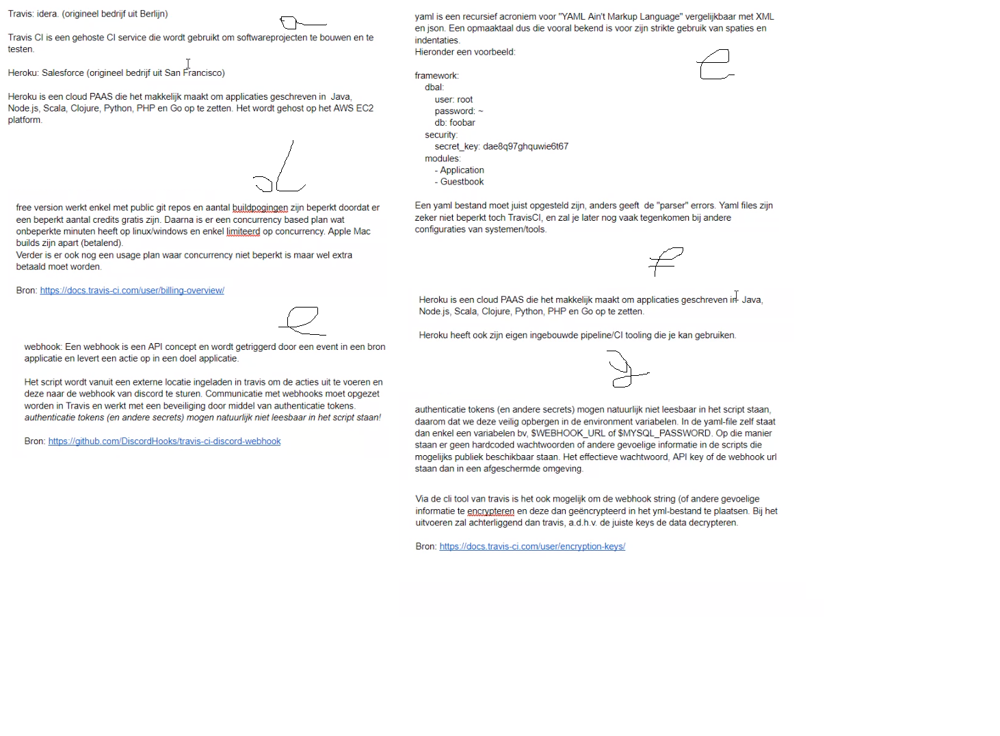

[](https://travis-ci.com/IneMentenPXL/OpsDev_calculator)

## a) Inventariseer kort in oplossing.md waarvoor travis-ci en heroku gebruikt worden. Wie zit er achter deze toepassingen? Wat is het doel?

Travis: idera. (origineel bedrijf uit Berlijn)

Travis CI is een gehoste CI service die wordt gebruikt om softwareprojecten te bouwen en te testen.

Heroku: Salesforce (origineel bedrijf uit San Fransisco)

Heroku is een cloud PAAS die het makkelijk maakt om applicaties gebschreven in Java, Node.js, Scala, Clojure, Python, PHP en Go op te zetten. Het wordt gehost op jet AWS EC2 platform.

## b) Na het verkennen van Travis-CI zal je merken dat er gebruikgemaakt wordt van yaml files. Wat voor soort files zijn dit? Hoe zijn die opgebouwd? Hoe zit een yaml syntax/structuur eruit?

Yaml is een recursief acroniem voor "YAML Ain't Markup Language" vergelijkbaar met XML en json. Een opmaaktabel dus die vooral bekend is voor zijn strikte gebruik van spaties en indentaties. 
Hieronder een voorbeeld:
````
framwork:  
  dbal:  
    user: root  
    password: ~  
    db: foobar  
  security:  
    secret_key: dae8q97ghquwie6t67  
  modules:  
    - Application  
    - Guestbook
````   
Een yaml bestand moet juist opgesteld zijn, anders geeft de "parser" errors. Yaml files zijn zeker niet beperkt tot TravisCI, en zal je later nog vaak tegenkomen bij andere configuraties van systemen/tools. 

## c) Met welke file uit jenkins kan je de .travis.yml file vergelijken?

De Jenkinsfile.

## d) Wat zijn de limitaties van de “free” versie van Travis-CI juist? Bekijk ook zeker eens de integratie van Travis-CI & pull requests!

Free version werkt enkel met public git repos en aantal buildpogingen zijn beperkt doordat er een beperkt aantal credits gratis zijn. Daarna is er een concurrency based plan wat onbeperkte minuten heeft op linux/windows en enkel limiteerd op concurrency. Apple Mac builds zijn apart (betalend).
Verder is er ook nog een usage plan waar concurrency niet beperkt is maar wel extra betaald moet worden.

## e) Licht toe hoe de webhook integratie van travis en discord werkt. Wat heeft dit jou geleerd over het gebruiken van externe scripts?

Webhook: Een webhook is een API concept en wordt getriggerd door een event in een bron applicatie en levert een actie op in een doel applicatie.

Het script wordt vanuit een externe locatie ingeladen in travis om de acties uit te voeren en deze naar de webhook van discord te sturen. Communicatie met webhooks moet opgezet worden in Travis en werkt met een beveiliging door middel van authenticatie tokens.
_Authenticatie tokens (en andere secrets) mogen natuurlijk niet leesbaar in het script staan!_

## f) Wat is heroku juist? Waarvoor kunnen we dat gebruiken?

Heroku is een cloud PAAS die het makkelijk maakt om applicaties gebschreven in Java, Node.js, Scala, Clojure, Python, PHP en Go op te zetten.

Heroku heeft ook zijn eigen ingebouwde pipeline/CI tooling die je kan gebruiken.

## g) Waarom maken we voor het gebruik van de API key & webhook URL gebruik van environment variabelen? Wat is daar het voordeel van? Zijn er nog andere manieren waarop je dit kon doen?

Authenticatie tokens (en andere secrets) mogen natuurlijk niet leesbaar in het script staan, daarom dat we deze veilig opbergen in de environment variabelen. In de yaml-file zelf staat dan enkel een variabele bv. $WEBHOOK_URL of $MYSQL_PASSWORD. Op die manier staan er geen hardcoded wachtwoorden of andere gevoelige informatie in de scripts die mogelijks publiek beschikbaar staan. Het effectieve wachtwoord, API key of de webhook url staan dan in een afgeschermde omgeving.

Via de cli tool van travis is het ook mogelijk om de webhook string (of andere gevoelige informatie) te encrypteren en deze dan geëncrypteerd in het yml-bestand te plaatsen. Bij het uitvoeren zal achterliggend dan travis a.d.h.v. de juiste keys de data decrypteren.

## Afbeelding

